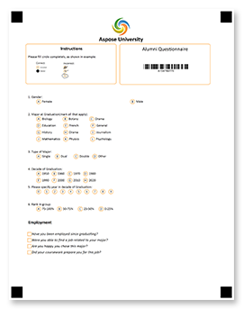










Aspose.OMR for .NET je spolehlivé a všestranné programovací API pro <b>navrhování</b> a <b>automatické rozpoznávání</b> ručně vyplněných odpovědních archů, průzkumů, testů, hlasovacích lístků, formulářů pro zkoušky SAT, pojistných událostí a podobných dokumentů, ve kterých respondenti odpovídají na otázku vylosováním náhodného označte v kruhu nebo čtverci. Dlouhý a k chybám náchylný proces ručního čtení a agregace výsledků ze stovek a tisíců formulářů sestává z <b>10 řádků kódu</b> v C#, F# nebo Visual Basic, kterému snadno porozumí a podpoří i nezkušení vývojáři.

Naše knihovna OMR nabízí vysoce flexibilní značkovací jazyk, který vám umožňuje vytvářet formuláře připravené pro OMR jakéhokoli rozvržení a složitosti bez návrhových nástrojů. Můžete kombinovat různé prvky, které nejlépe vyhovují vašemu účelu a cílovému publiku, a dále personalizovat a označovat své formuláře OMR přidáním log, čárových kódů, QR kódů nebo obrázků.



<!--Diagrams Start-->




 

  

   <header>
    <i class="fa fa-bars">
    </i>
    Vytvářejte formuláře OMR
   </header>
   <ul>
    <li>Flexibilní značkovací jazyky</li>
    <li>Programová tvorba formulářů</li>
    <li>QR kódy a čárové kódy</li>
    <li>Přidejte obrázky a značku</li>
    <li>Vícestránkové formuláře</li>
    <li>Všechny oblíbené velikosti papíru</li>
    <li>Nejsou potřeba žádné grafické editory</li>
   </ul>
  

  <!--/left-->
  

   <header>
    <i class="fa fa-eye">
    </i>
    Rozpoznat formuláře OMR
   </header>
   <ul>
    <li>Čtení naskenovaných obrázků a fotografií</li>
    <li>Vynikající přesnost rozpoznávání</li>
    <li>Není potřeba žádné vybavení</li>
    <li>Upravte otočené a zkosené obrázky</li>
    <li>Rozpoznat všechny typy známek</li>
    <li>Ladění přesnosti v reálném čase</li>
    <li>Dekódujte QR kódy a čárové kódy</li>
    <li>Zpracujte pole pro zápis</li>
   </ul>
  

  <!--/right-->
 

 <!--/row-->
 

  
  <header>
   Aspose.OMR
  </header>
  <footer>
   <small>
    <em>
     for
    </em>
    .NET
   </small>
  </footer>
 

 <!--/logo-->





 

  

   <header>
    <i class="fa fa-cubes">
    </i>
    .NET implementace
   </header>
   <ul>
    <li>
     .NET 5.0
    </li>
    <li>
     .NET Core 2.0 nebo novější
    </li>
    <li>
     .NET Framework 4.0 nebo novější
    </li>
   </ul>
  

  <!--/left-->
  

   <header>
    <i class="fa fa-laptop">
    </i>
    Aplikace
   </header>
   <ul>
    <li>
     Desktopové aplikace
    </li>
    <li>
     služby Windows
    </li>
    <li>
     ASP.NET MVC
    </li>
    <li>
     ASP.NET Web API
    </li>
    <li>
     Webové služby
    </li>
    <li>
     Cloudové služby
    </li>
   </ul>
  

  <!--/right-->
 

 <!--/row-->
 

  
  <header>
   Aspose.OMR
  </header>
  <footer>
   <small>
    <em>
     for
    </em>
    .NET
   </small>
  </footer>
 

 <!--/logo-->





 

  

   <header>
    <i class="fa fa-arrows-v">
    </i>
    Tisknutelné formuláře
   </header>
   <ul>
    <li>
     PDF
    </li>
    <li>
     JPEG
    </li>
    <li>
     PNG
    </li>
    <li>
     TIFF
    </li>
    <li>
     GIF
    </li>
    <li>
     BMP
    </li>
   </ul>
  

  <!--/left-->
  

   <header>
    <i class="fa fa-long-arrow-down">
    </i>
    Výsledky rozpoznávání
   </header>
   <ul>
    <li>CSV</li>
    <li>JSON</li>
    <li>XML</li>
   </ul>
  

  <!--/right-->
 

 <!--/row-->
 

  
  <header>
   Aspose.OMR
  </header>
  <footer>
   <small>
    <em>
     for
    </em>
    .NET
   </small>
  </footer>
 

 <!--/logo-->




<!--Diagrams End-->

<!--Feature-section Start-->

 
 

  

   <h2 class="pr-ft">
    Vlastnosti a schopnosti Aspose.OMR pro .NET
   </h2>
   

   

   

    <em class="fa fa-image ico-blue fa-2x col-lg-2">
    </em>
    

     Podporuje všechny obrazové formáty, které můžete získat ze skeneru nebo fotoaparátu
    

   

   

    <em class="fa fa-mobile ico-blue fa-2x col-lg-2">
    </em>
    

     Místo skeneru použijte fotoaparát chytrého telefonu
    

   

   

    <em class="fa fa-check ico-blue fa-2x col-lg-2">
    </em>
    

     Čte všechny typy značek nakreslených perem, tužkou nebo fixem
    

   

   

    <em class="fa fa-qrcode ico-blue fa-2x col-lg-2">
    </em>
    

     Personalizujte formuláře pomocí čárových kódů, QR kódů, značek a obrázků
    

   

   

    <em class="fa fa-sliders ico-blue fa-2x col-lg-2">
    </em>
    

     Ladění přesnosti v reálném čase prostřednictvím vizuálního ovládání uživatelského rozhraní
    

   

   

    <em class="fa fa-folder ico-blue fa-2x col-lg-2">
    </em>
    

     Rozpozná vícestránkové formuláře a všechny obrázky ve složce
    

   

   

    <em class="fa fa-file ico-blue fa-2x col-lg-2">
    </em>
    

     Podporuje všechny oblíbené velikosti papíru i nestandardní
    

   

   

    <em class="fa fa-pencil ico-blue fa-2x col-lg-2">
    </em>
    

     Zpracovává pole pro zápis a vlastní výkresy
    

   

   

    <em class="fa fa-eye ico-blue fa-2x col-lg-2">
    </em>
    

     Vynikající přesnost rozpoznávání i v obtížných podmínkách
    

   

<h2 class="h2title">Snadná instalace</h2>

Aspose.OMR for .NET je distribuován jako odlehčený balíček NuGet nebo jako <a href="https://releases.aspose.com/omr/net/">soubor ke stažení</a> s minimálními závislostmi. Jednoduše jej <a href="https://docs.aspose.com/omr/net/installation/">nainstalujte</a> do svého projektu a jste připraveni používat všechny možnosti OMR a ukládat výsledky rozpoznávání v jakémkoli z podporovaných formátů.

<a href="https://purchase.aspose.com/temporary-license">Požádejte o dočasnou licenci</a> , abyste mohli začít budovat plně funkční aplikaci OMR bez jakýchkoli omezení a omezení.

<h2 class="h2title">Snadné použití</h2>

K vytvoření formuláře OMR, jako je průzkum spokojenosti zákazníků, a rozpoznání vyplněného formuláře vám stačí jen několik řádků kódu. Ano, opravdu je to tak jednoduché! Neberte naše slova, <a href="https://docs.aspose.com/omr/net/hello-world/">zkuste to sami</a> .

<h2 class="h2title">Neomezené možnosti</h2>

Technologie optického rozpoznávání značek (OMR) má mnoho aplikací a může výrazně zjednodušit téměř jakoukoli část vašeho života, když potřebujete sbírat a analyzovat ručně vyplněná data. Plně automatizuje proces, umožňuje rozpoznání stovek listů za minutu s téměř 100% přesností a ukládá výsledky přímo do databáze pro další agregaci a analýzu. Aplikace zahrnují, ale nejsou omezeny na:

<ul>
	<li>Vzdělávání: odpovědní listy, testy, kvízy, formuláře SAT a mnoho dalších.</li>
	<li>Dotazníky: průzkumy spokojenosti zákazníků, formuláře zpětné vazby, objednávky, preference jídla.</li>
	<li>Aplikace: pojistné události, finanční žádosti, hraniční vstupní formuláře.</li>
	<li>A mnoho dalších.</li>
</ul>

<h2 class="h2title">Vytvářejte formuláře bez návrhových nástrojů</h2>

Naše knihovna podporuje kompletní pracovní postup OMR – od návrhu formuláře až po rozpoznání jeho vyplněných tištěných kopií. Nabízí vysoce flexibilní <a href="https://docs.aspose.com/omr/net/design-form/">značkovací jazyky</a> s <b>20</b> prvky rozvržení a obsahu, které lze vzájemně kombinovat a vytvářet formy libovolného rozvržení, které mohou být složité.

	
	
	

Rozvržení a obsah formuláře OMR můžete také popsat přímo v kódu aplikace. Tento přístup funguje nejlépe, když potřebujete navrhnout formuláře s personalizovanými poli, jako je jméno respondenta, fotografie nebo jedinečný QR kód.

Výsledky rozpoznávání jsou vráceny v nejoblíbenějších formátech pro ukládání dat, které lze importovat do jakékoli populární databáze nebo analytického systému: JSON, XML nebo CSV.

<h2 class="h2title">Není potřeba žádné vybavení</h2>

Již nepotřebujete specializované skenery, jedinečný transoptický papír, magnetický inkoust a další „hardwarová“ řešení. Pokročilá analýza obrazu a techniky umělé inteligence umožnily místo vyhrazených zařízení použít obyčejnou tužku a papír, běžnou kancelářskou kopírku nebo dokonce fotoaparát chytrého telefonu, aniž by to ovlivnilo přesnost rozpoznávání a důvěru ve výsledek. Naše knihovna umožňuje vytvářet čistě softwarová řešení OMR, která konkurují tradičním hardwarovým systémům za mnohem nižší náklady.

OMR API automaticky opravuje otočené a zkosené obrázky, takže i fotografie nízké kvality jsou rozpoznány s vysokou mírou spolehlivosti. V těžkých případech můžete doladit zpracování formuláře a produkovat výsledky s téměř 100% přesností.

<h2 class="h2title">Učte se příkladem</h2>

Aspose.OMR for .NET přichází s řadou <a href="https://docs.aspose.com/omr/net/showcases/">příkladů</a> , které vám umožní rychle se seznámit s jeho funkcemi a možnostmi a poskytnou vám představu o vytváření řešení pro vaše obchodní potřeby.

  

 

<!--Feature-section End-->





























    



