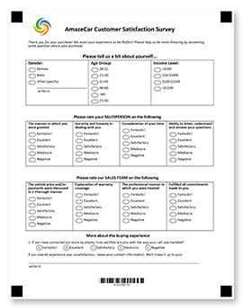










Aspose.OMR für .NET ist eine zuverlässige und vielseitige Programmier-API zum <b>Entwerfen</b> und <b>automatischen Erkennen</b> von handgefüllten Antwortbögen, Umfragen, Tests, Stimmzetteln, SAT-Prüfungsformularen, Versicherungsansprüchen und ähnlichen Dokumenten, in denen die Befragten eine Frage beantworten, indem sie eine zufällige ziehen Kreis oder Quadrat markieren. Der lange und fehleranfällige Prozess des manuellen Lesens und Aggregierens von Ergebnissen aus Hunderten und Tausenden von Formularen reduziert sich auf <b>10 Codezeilen</b> in C#, F# oder Visual Basic, die selbst unerfahrene Entwickler leicht verstehen und unterstützen können.

Unsere OMR-Bibliothek bietet eine hochflexible Auszeichnungssprache, mit der Sie OMR-fähige Formulare mit beliebigem Layout und beliebiger Komplexität ohne Design-Tools erstellen können. Sie können eine Vielzahl von Elementen kombinieren, die am besten zu Ihrem Zweck und Ihrer Zielgruppe passen, und Ihre OMR-Formulare weiter personalisieren und brandmarken, indem Sie Logos, Barcodes, QR-Codes oder Bilder hinzufügen.



<!--Diagrams Start-->




 

  

   <header>
    <i class="fa fa-bars">
    </i>
    Erstellen Sie OMR-Formulare
   </header>
   <ul>
    <li>Flexible Auszeichnungssprachen</li>
    <li>Programmatische Erstellung von Formularen</li>
    <li>QR-Codes und Barcodes</li>
    <li>Fügen Sie Bilder und Branding hinzu</li>
    <li>Mehrseitige Formulare</li>
    <li>Alle gängigen Papierformate</li>
    <li>Keine grafischen Editoren erforderlich</li>
   </ul>
  

  <!--/left-->
  

   <header>
    <i class="fa fa-eye">
    </i>
    OMR-Formulare erkennen
   </header>
   <ul>
    <li>Lesen Sie gescannte Bilder und Fotos</li>
    <li>Hervorragende Erkennungsgenauigkeit</li>
    <li>Keine Ausrüstung erforderlich</li>
    <li>Passen Sie gedrehte und schiefe Bilder an</li>
    <li>Erkennen Sie alle Arten von Markierungen</li>
    <li>Echtzeit-Genauigkeits-Tuning</li>
    <li>Decodieren Sie QR-Codes und Barcodes</li>
    <li>Einschreibfelder bearbeiten</li>
   </ul>
  

  <!--/right-->
 

 <!--/row-->
 

  
  <header>
   Aspose.OMR
  </header>
  <footer>
   <small>
    <em>
     for
    </em>
    .NET
   </small>
  </footer>
 

 <!--/logo-->





 

  

   <header>
    <i class="fa fa-cubes">
    </i>
    .NET-Implementierungen
   </header>
   <ul>
    <li>
     .NET 5.0
    </li>
    <li>
     .NET Core 2.0 oder höher
    </li>
    <li>
     .NET Framework 4.0 oder höher
    </li>
   </ul>
  

  <!--/left-->
  

   <header>
    <i class="fa fa-laptop">
    </i>
    Anwendungen
   </header>
   <ul>
    <li>
     Desktop-Anwendungen
    </li>
    <li>
     Windows-Dienste
    </li>
    <li>
     ASP.NET MVC
    </li>
    <li>
     ASP.NET Web API
    </li>
    <li>
     Internetdienste
    </li>
    <li>
     Cloud-Services
    </li>
   </ul>
  

  <!--/right-->
 

 <!--/row-->
 

  
  <header>
   Aspose.OMR
  </header>
  <footer>
   <small>
    <em>
     for
    </em>
    .NET
   </small>
  </footer>
 

 <!--/logo-->





 

  

   <header>
    <i class="fa fa-arrows-v">
    </i>
    Druckbare Formulare
   </header>
   <ul>
    <li>
     PDF
    </li>
    <li>
     JPEG
    </li>
    <li>
     PNG
    </li>
    <li>
     TIFF
    </li>
    <li>
     GIF
    </li>
    <li>
     BMP
    </li>
   </ul>
  

  <!--/left-->
  

   <header>
    <i class="fa fa-long-arrow-down">
    </i>
    Erkennungsergebnisse
   </header>
   <ul>
    <li>CSV</li>
    <li>JSON</li>
    <li>XML</li>
   </ul>
  

  <!--/right-->
 

 <!--/row-->
 

  
  <header>
   Aspose.OMR
  </header>
  <footer>
   <small>
    <em>
     for
    </em>
    .NET
   </small>
  </footer>
 

 <!--/logo-->




<!--Diagrams End-->

<!--Feature-section Start-->

 
 

  

   <h2 class="pr-ft">
    Merkmale und Fähigkeiten von Aspose.OMR für .NET
   </h2>
   

   

   

    <em class="fa fa-image ico-blue fa-2x col-lg-2">
    </em>
    

     Unterstützt alle Bildformate, die Sie von einem Scanner oder einer Kamera erhalten können
    

   

   

    <em class="fa fa-mobile ico-blue fa-2x col-lg-2">
    </em>
    

     Verwenden Sie Ihre Smartphone-Kamera anstelle eines Scanners
    

   

   

    <em class="fa fa-check ico-blue fa-2x col-lg-2">
    </em>
    

     Liest alle Arten von Markierungen, die mit einem Kugelschreiber, Bleistift oder Marker gezeichnet wurden
    

   

   

    <em class="fa fa-qrcode ico-blue fa-2x col-lg-2">
    </em>
    

     Personalisieren Sie Formulare mit Barcodes, QR-Codes, Branding und Bildern
    

   

   

    <em class="fa fa-sliders ico-blue fa-2x col-lg-2">
    </em>
    

     Echtzeit-Genauigkeits-Tuning durch eine visuelle UI-Steuerung
    

   

   

    <em class="fa fa-folder ico-blue fa-2x col-lg-2">
    </em>
    

     Erkennt mehrseitige Formulare und alle Bilder in einem Ordner
    

   

   

    <em class="fa fa-file ico-blue fa-2x col-lg-2">
    </em>
    

     Unterstützt alle gängigen Papierformate sowie nicht standardmäßige
    

   

   

    <em class="fa fa-pencil ico-blue fa-2x col-lg-2">
    </em>
    

     Verarbeitet Eingabefelder und benutzerdefinierte Zeichnungen
    

   

   

    <em class="fa fa-eye ico-blue fa-2x col-lg-2">
    </em>
    

     Hervorragende Erkennungsgenauigkeit auch unter schwierigen Bedingungen
    

   

<h2 class="h2title">Einfach zu installieren</h2>

Aspose.OMR für .NET wird als leichtes NuGet-Paket oder als <a href="https://releases.aspose.com/omr/net/">herunterladbare Datei</a> mit minimalen Abhängigkeiten vertrieben. <a href="https://docs.aspose.com/omr/net/installation/">Installieren</a> Sie es einfach in Ihrem Projekt und Sie können alle OMR-Funktionen nutzen und Erkennungsergebnisse in einem der unterstützten Formate speichern.

<a href="https://purchase.aspose.com/temporary-license">Fordern Sie eine temporäre Lizenz</a> an, um mit dem Erstellen einer voll funktionsfähigen OMR-Anwendung ohne Einschränkungen zu beginnen.

<h2 class="h2title">Einfach zu verwenden</h2>

Sie benötigen nur wenige Codezeilen, um ein OMR-Formular wie eine Kundenzufriedenheitsumfrage zu erstellen und das ausgefüllte Formular zu erkennen. Ja, es ist wirklich so einfach! Nehmen Sie nicht unsere Worte, <a href="https://docs.aspose.com/omr/net/hello-world/">probieren Sie es selbst aus</a> .

<h2 class="h2title">Unbegrenzte Möglichkeiten</h2>

Die Optical Mark Recognition (OMR)-Technologie hat viele Anwendungen und kann fast jeden Teil Ihres Lebens erheblich vereinfachen, wenn Sie manuell ausgefüllte Daten sammeln und analysieren müssen. Es automatisiert den Prozess vollständig, sodass Hunderte von Blättern pro Minute mit nahezu 100-prozentiger Genauigkeit erkannt werden können, und speichert die Ergebnisse direkt in einer Datenbank zur weiteren Aggregation und Analyse. Zu den Anwendungen gehören unter anderem:

<ul>
	<li>Bildung: Antwortbögen, Tests, Quiz, SAT-Formulare und vieles mehr.</li>
	<li>Fragebögen: Umfragen zur Kundenzufriedenheit, Feedback-Formulare, Bestellungen, Essenspräferenzen.</li>
	<li>Anträge: Versicherungsansprüche, Finanzanträge, Grenzeinreiseformulare.</li>
	<li>Und viele mehr.</li>
</ul>

<h2 class="h2title">Erstellen Sie Formulare ohne Designtools</h2>

Unsere Bibliothek unterstützt den kompletten OMR-Workflow – vom Entwerfen eines Formulars bis zum Erkennen seiner ausgefüllten Ausdrucke. Es bietet hochflexible <a href="https://docs.aspose.com/omr/net/design-form/">Auszeichnungssprachen</a> mit <b>20</b> Layout- und Inhaltselementen, die miteinander kombiniert werden können, um Formulare beliebiger Layout-Komplexität zu erstellen.

	
	
	

Sie können das Layout und den Inhalt eines OMR-Formulars auch direkt im Anwendungscode beschreiben. Dieser Ansatz funktioniert am besten, wenn Sie Formulare mit personalisierten Feldern wie dem Namen eines Befragten, einem Foto oder einem eindeutigen QR-Code entwerfen müssen.

Erkennungsergebnisse werden in den gängigsten Datenspeicherformaten zurückgegeben, die in jedes gängige Datenbank- oder Analysesystem importiert werden können: JSON, XML oder CSV.

<h2 class="h2title">Keine Ausrüstung erforderlich</h2>

Sie benötigen keine spezialisierten Scanner, einzigartiges transoptisches Papier, magnetische Tinte und andere „Hardware“-Lösungen mehr. Erweiterte Bildanalyse und Techniken der künstlichen Intelligenz machten es möglich, einen normalen Stift und Papier, einen gewöhnlichen Bürokopierer oder sogar eine Smartphone-Kamera anstelle von dedizierten Geräten zu verwenden, ohne die Erkennungsgenauigkeit und das Vertrauen in das Ergebnis zu beeinträchtigen. Unsere Bibliothek ermöglicht den Aufbau reiner Software-OMR-Lösungen, die mit herkömmlichen hardwarebasierten Systemen zu wesentlich geringeren Kosten konkurrieren können.

Die OMR-API korrigiert automatisch gedrehte und schiefe Bilder, sodass auch Fotos mit geringer Qualität mit hoher Sicherheit erkannt werden. In schwierigen Fällen können Sie die Formularverarbeitung optimieren und Ergebnisse mit nahezu 100-prozentiger Genauigkeit erzielen.

<h2 class="h2title">Lernen Sie am Beispiel</h2>

Aspose.OMR für .NET wird mit einer Reihe von <a href="https://docs.aspose.com/omr/net/showcases/">Beispielen</a> geliefert, die es Ihnen ermöglichen, sich schnell mit seinen Funktionen und Fähigkeiten vertraut zu machen, und Ihnen eine Vorstellung davon vermitteln, wie Sie Lösungen für Ihre Geschäftsanforderungen erstellen können.

  

 

<!--Feature-section End-->





























    



