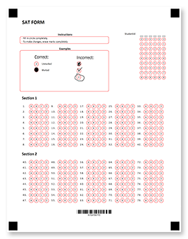










Το Aspose.OMR for .NET είναι ένα αξιόπιστο και ευέλικτο API προγραμματισμού για το <b>σχεδιασμό</b> και την <b>αυτόματη αναγνώριση</b> φύλλων απαντήσεων, ερευνών, δοκιμών, ψηφοδελτίων, εντύπων εξετάσεων SAT, ασφαλιστικών αξιώσεων και παρόμοιων εγγράφων στα οποία οι ερωτηθέντες απαντούν σε μια ερώτηση σχεδιάζοντας τυχαία σημάδι σε κύκλο ή τετράγωνο. Η μακρά και επιρρεπής σε σφάλματα διαδικασία της μη αυτόματης ανάγνωσης και συγκέντρωσης αποτελεσμάτων από εκατοντάδες και χιλιάδες φόρμες καταλήγει σε <b>10 γραμμές κώδικα</b> σε C#, F# ή Visual Basic, που ακόμη και οι άπειροι προγραμματιστές μπορούν εύκολα να κατανοήσουν και να υποστηρίξουν.

Η βιβλιοθήκη OMR μας προσφέρει μια εξαιρετικά ευέλικτη γλώσσα σήμανσης που σας επιτρέπει να δημιουργείτε φόρμες OMR-ready οποιασδήποτε διάταξης και πολυπλοκότητας χωρίς εργαλεία σχεδίασης. Μπορείτε να συνδυάσετε μια ποικιλία στοιχείων που ταιριάζουν καλύτερα στο σκοπό και το κοινό-στόχο σας και να εξατομικεύσετε και να επωνυμίσετε περαιτέρω τις φόρμες OMR σας προσθέτοντας λογότυπα, γραμμικούς κώδικες, κωδικούς QR ή εικόνες.



<!--Diagrams Start-->




 

  

   <header>
    <i class="fa fa-bars">
    </i>
    Δημιουργήστε φόρμες OMR
   </header>
   <ul>
    <li>Ευέλικτες γλώσσες σήμανσης</li>
    <li>Προγραμματική δημιουργία φορμών</li>
    <li>Κωδικοί QR και barcodes</li>
    <li>Προσθέστε εικόνες και επωνυμία</li>
    <li>Φόρμες πολλαπλών σελίδων</li>
    <li>Όλα τα δημοφιλή μεγέθη χαρτιού</li>
    <li>Δεν απαιτούνται επεξεργαστές γραφικών</li>
   </ul>
  

  <!--/left-->
  

   <header>
    <i class="fa fa-eye">
    </i>
    Αναγνωρίστε τις φόρμες OMR
   </header>
   <ul>
    <li>Διαβάστε σαρωμένες εικόνες και φωτογραφίες</li>
    <li>Ανώτερη ακρίβεια αναγνώρισης</li>
    <li>Δεν απαιτείται εξοπλισμός</li>
    <li>Προσαρμογή περιστρεφόμενων και λοξών εικόνων</li>
    <li>Αναγνωρίστε όλα τα είδη σημάτων</li>
    <li>Συντονισμός ακρίβειας σε πραγματικό χρόνο</li>
    <li>Αποκωδικοποίηση κωδικών QR και barcodes</li>
    <li>Επεξεργασία πεδίων εγγραφής</li>
   </ul>
  

  <!--/right-->
 

 <!--/row-->
 

  
  <header>
   Aspose.OMR
  </header>
  <footer>
   <small>
    <em>
     for
    </em>
    .NET
   </small>
  </footer>
 

 <!--/logo-->





 

  

   <header>
    <i class="fa fa-cubes">
    </i>
    Υλοποιήσεις .NET
   </header>
   <ul>
    <li>
     .NET 5.0
    </li>
    <li>
     .NET Core 2.0 ή μεταγενέστερη έκδοση
    </li>
    <li>
     .NET Framework 4.0 ή νεότερη έκδοση
    </li>
   </ul>
  

  <!--/left-->
  

   <header>
    <i class="fa fa-laptop">
    </i>
    Εφαρμογές
   </header>
   <ul>
    <li>
     Εφαρμογές επιτραπέζιου υπολογιστή
    </li>
    <li>
     υπηρεσίες Windows
    </li>
    <li>
     ASP.NET MVC
    </li>
    <li>
     ASP.NET Web API
    </li>
    <li>
     Υπηρεσίες διαδικτύου
    </li>
    <li>
     Υπηρεσίες Cloud
    </li>
   </ul>
  

  <!--/right-->
 

 <!--/row-->
 

  
  <header>
   Aspose.OMR
  </header>
  <footer>
   <small>
    <em>
     for
    </em>
    .NET
   </small>
  </footer>
 

 <!--/logo-->





 

  

   <header>
    <i class="fa fa-arrows-v">
    </i>
    Εκτυπώσιμα έντυπα
   </header>
   <ul>
    <li>
     PDF
    </li>
    <li>
     JPEG
    </li>
    <li>
     PNG
    </li>
    <li>
     TIFF
    </li>
    <li>
     GIF
    </li>
    <li>
     BMP
    </li>
   </ul>
  

  <!--/left-->
  

   <header>
    <i class="fa fa-long-arrow-down">
    </i>
    Αποτελέσματα αναγνώρισης
   </header>
   <ul>
    <li>CSV</li>
    <li>JSON</li>
    <li>XML</li>
   </ul>
  

  <!--/right-->
 

 <!--/row-->
 

  
  <header>
   Aspose.OMR
  </header>
  <footer>
   <small>
    <em>
     for
    </em>
    .NET
   </small>
  </footer>
 

 <!--/logo-->




<!--Diagrams End-->

<!--Feature-section Start-->

 
 

  

   <h2 class="pr-ft">
    Χαρακτηριστικά και δυνατότητες του Aspose.OMR για .NET
   </h2>
   

   

   

    <em class="fa fa-image ico-blue fa-2x col-lg-2">
    </em>
    

     Υποστηρίζει όλες τις μορφές εικόνας που μπορείτε να λάβετε από έναν σαρωτή ή μια κάμερα
    

   

   

    <em class="fa fa-mobile ico-blue fa-2x col-lg-2">
    </em>
    

     Χρησιμοποιήστε την κάμερα του smartphone σας αντί για σαρωτή
    

   

   

    <em class="fa fa-check ico-blue fa-2x col-lg-2">
    </em>
    

     Διαβάζει όλους τους τύπους σημαδιών που σχεδιάζονται με στυλό, μολύβι ή μαρκαδόρο
    

   

   

    <em class="fa fa-qrcode ico-blue fa-2x col-lg-2">
    </em>
    

     Εξατομικεύστε φόρμες με γραμμωτούς κώδικες, κωδικούς QR, επωνυμία και εικόνες
    

   

   

    <em class="fa fa-sliders ico-blue fa-2x col-lg-2">
    </em>
    

     Συντονισμός ακρίβειας σε πραγματικό χρόνο μέσω ενός οπτικού ελέγχου διεπαφής χρήστη
    

   

   

    <em class="fa fa-folder ico-blue fa-2x col-lg-2">
    </em>
    

     Αναγνωρίζει πολυσέλιδες φόρμες και όλες τις εικόνες σε ένα φάκελο
    

   

   

    <em class="fa fa-file ico-blue fa-2x col-lg-2">
    </em>
    

     Υποστηρίζει όλα τα δημοφιλή μεγέθη χαρτιού καθώς και τα μη τυπικά
    

   

   

    <em class="fa fa-pencil ico-blue fa-2x col-lg-2">
    </em>
    

     Επεξεργάζεται πεδία εγγραφής και προσαρμοσμένα σχέδια
    

   

   

    <em class="fa fa-eye ico-blue fa-2x col-lg-2">
    </em>
    

     Ανώτερη ακρίβεια αναγνώρισης ακόμα και σε δύσκολες συνθήκες
    

   

<h2 class="h2title">Εύκολο στην εγκατάσταση</h2>

Το Aspose.OMR για .NET διανέμεται ως ένα ελαφρύ πακέτο NuGet ή ως <a href="https://releases.aspose.com/omr/net/">αρχείο</a> με δυνατότητα λήψης με ελάχιστες εξαρτήσεις. Απλώς <a href="https://docs.aspose.com/omr/net/installation/">εγκαταστήστε</a> το στο έργο σας και είστε έτοιμοι να χρησιμοποιήσετε όλες τις δυνατότητες OMR και να αποθηκεύσετε τα αποτελέσματα αναγνώρισης σε οποιαδήποτε από τις υποστηριζόμενες μορφές.

<a href="https://purchase.aspose.com/temporary-license">Ζητήστε μια προσωρινή άδεια</a> για να ξεκινήσετε τη δημιουργία μιας πλήρως λειτουργικής εφαρμογής OMR χωρίς περιορισμούς και περιορισμούς.

<h2 class="h2title">Εύχρηστος</h2>

Χρειάζεστε μόνο μερικές γραμμές κώδικα για να δημιουργήσετε μια φόρμα OMR όπως μια έρευνα ικανοποίησης πελατών και να αναγνωρίσετε τη συμπληρωμένη φόρμα. Ναι, είναι πραγματικά τόσο απλό! Μην δέχεστε τα λόγια μας, <a href="https://docs.aspose.com/omr/net/hello-world/">δοκιμάστε το μόνοι σας</a> .

<h2 class="h2title">Απεριόριστες δυνατότητες</h2>

Η τεχνολογία Optical Mark Recognition (OMR) έχει πολλές εφαρμογές και μπορεί να απλοποιήσει σημαντικά σχεδόν οποιοδήποτε μέρος της ζωής σας όταν χρειάζεται να συλλέξετε και να αναλύσετε μη αυτόματα συμπληρωμένα δεδομένα. Αυτοματοποιεί πλήρως τη διαδικασία, επιτρέποντας την αναγνώριση εκατοντάδων φύλλων ανά λεπτό με σχεδόν 100% ακρίβεια και αποθηκεύει τα αποτελέσματα απευθείας σε μια βάση δεδομένων για περαιτέρω συγκέντρωση και ανάλυση. Οι εφαρμογές περιλαμβάνουν αλλά δεν περιορίζονται σε:

<ul>
	<li>Εκπαίδευση: φύλλα απαντήσεων, τεστ, κουίζ, φόρμες SAT και πολλά άλλα.</li>
	<li>Ερωτηματολόγια: έρευνες ικανοποίησης πελατών, φόρμες σχολίων, παραγγελίες, προτιμήσεις γευμάτων.</li>
	<li>Αιτήσεις: ασφαλιστικές απαιτήσεις, οικονομικές αιτήσεις, έντυπα εισόδου στα σύνορα.</li>
	<li>Και πολλά άλλα.</li>
</ul>

<h2 class="h2title">Δημιουργήστε φόρμες χωρίς εργαλεία σχεδίασης</h2>

Η βιβλιοθήκη μας υποστηρίζει την πλήρη ροή εργασιών OMR - από το σχεδιασμό μιας φόρμας έως την αναγνώριση των συμπληρωμένων έντυπων αντιγράφων της. Προσφέρει εξαιρετικά ευέλικτες <a href="https://docs.aspose.com/omr/net/design-form/">γλώσσες σήμανσης</a> με <b>20</b> διάταξη και στοιχεία περιεχομένου που μπορούν να συνδυαστούν μεταξύ τους για να δημιουργήσουν μορφές οποιασδήποτε πολυπλοκότητας διάταξης.

	
	
	

Μπορείτε επίσης να περιγράψετε τη διάταξη και το περιεχόμενο μιας φόρμας OMR απευθείας στον κώδικα της εφαρμογής. Αυτή η προσέγγιση λειτουργεί καλύτερα όταν χρειάζεται να σχεδιάσετε φόρμες με εξατομικευμένα πεδία, όπως το όνομα του ερωτώμενου, τη φωτογραφία ή έναν μοναδικό κωδικό QR.

Τα αποτελέσματα αναγνώρισης επιστρέφονται στις πιο δημοφιλείς μορφές αποθήκευσης δεδομένων που μπορούν να εισαχθούν σε οποιαδήποτε δημοφιλή βάση δεδομένων ή σύστημα ανάλυσης: JSON, XML ή CSV.

<h2 class="h2title">Δεν απαιτείται εξοπλισμός</h2>

Δεν χρειάζεστε πλέον εξειδικευμένους σαρωτές, μοναδικό τρανσοπτικό χαρτί, μαγνητικό μελάνι και άλλες λύσεις «υλισμικού». Οι προηγμένες τεχνικές ανάλυσης εικόνας και τεχνητής νοημοσύνης κατέστησαν δυνατή τη χρήση κανονικού στυλό και χαρτιού, κοινής φωτοαντιγραφικής μηχανής γραφείου ή ακόμα και κάμερας smartphone αντί για αποκλειστικές συσκευές, χωρίς να επηρεάζεται η ακρίβεια αναγνώρισης και η εμπιστοσύνη στο αποτέλεσμα. Η βιβλιοθήκη μας επιτρέπει τη δημιουργία λύσεων OMR αμιγώς λογισμικού που ανταγωνίζονται ισοδύναμα με τα παραδοσιακά συστήματα που βασίζονται σε υλικό με πολύ χαμηλότερο κόστος.

Το OMR API διορθώνει αυτόματα τις περιστρεφόμενες και λοξές εικόνες, έτσι ώστε ακόμη και οι φωτογραφίες χαμηλής ποιότητας να αναγνωρίζονται με υψηλό βαθμό εμπιστοσύνης. Σε δύσκολες περιπτώσεις, μπορείτε να ρυθμίσετε την επεξεργασία φόρμας και να παράγετε αποτελέσματα με σχεδόν 100% ακρίβεια.

<h2 class="h2title">Μάθετε με το Παράδειγμα</h2>

Το Aspose.OMR για .NET συνοδεύεται από μια σειρά από <a href="https://docs.aspose.com/omr/net/showcases/">παραδείγματα</a> που σας επιτρέπουν να εξοικειωθείτε γρήγορα με τις λειτουργίες και τις δυνατότητές του και σας δίνουν μια ιδέα για τη δημιουργία λύσεων για τις ανάγκες της επιχείρησής σας.

  

 

<!--Feature-section End-->





























    



