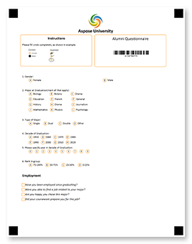










.NET के लिए Aspose.OMR हाथ से भरी उत्तर पुस्तिकाओं, सर्वेक्षणों, परीक्षणों, मतपत्रों, SAT परीक्षा प्रपत्रों, बीमा दावों और इसी तरह के दस्तावेजों को <b>डिजाइन करने</b> और <b>स्वचालित रूप से पहचानने</b> के लिए एक विश्वसनीय और बहुमुखी प्रोग्रामिंग एपीआई है जिसमें उत्तरदाता यादृच्छिक रूप से एक प्रश्न का उत्तर देते हैं। एक सर्कल या वर्ग में चिह्नित करें। सैकड़ों और हजारों रूपों से परिणामों को मैन्युअल रूप से पढ़ने और एकत्र करने की लंबी और त्रुटि-प्रवण प्रक्रिया सी #, एफ #, या विजुअल बेसिक में <b>कोड की 10 पंक्तियों</b> तक आती है, यहां तक कि अनुभवहीन डेवलपर्स भी आसानी से समझ और समर्थन कर सकते हैं।

हमारी ओएमआर लाइब्रेरी अत्यधिक लचीली मार्कअप भाषा प्रदान करती है जो आपको डिजाइन टूल के बिना किसी भी लेआउट और जटिलता के ओएमआर-रेडी फॉर्म बनाने की अनुमति देती है। आप विभिन्न प्रकार के तत्वों को जोड़ सकते हैं जो आपके उद्देश्य और लक्षित दर्शकों के लिए सबसे उपयुक्त हैं, और लोगो, बारकोड, क्यूआर कोड, या छवियों को जोड़कर अपने ओएमआर रूपों को और वैयक्तिकृत और ब्रांड कर सकते हैं।



<!--Diagrams Start-->




 

  

   <header>
    <i class="fa fa-bars">
    </i>
    ओएमआर फॉर्म बनाएं
   </header>
   <ul>
    <li>लचीली मार्कअप भाषाएं</li>
    <li>प्रपत्रों का प्रोग्रामेटिक निर्माण</li>
    <li>क्यूआर कोड और बारकोड</li>
    <li>चित्र और ब्रांडिंग जोड़ें</li>
    <li>बहु-पृष्ठ प्रपत्र</li>
    <li>सभी लोकप्रिय पेपर आकार</li>
    <li>कोई ग्राफिक संपादकों की आवश्यकता नहीं है</li>
   </ul>
  

  <!--/left-->
  

   <header>
    <i class="fa fa-eye">
    </i>
    ओएमआर फॉर्म को पहचानें
   </header>
   <ul>
    <li>स्कैन की गई छवियों और तस्वीरों को पढ़ें</li>
    <li>बेहतर पहचान सटीकता</li>
    <li>किसी उपकरण की आवश्यकता नहीं</li>
    <li>घुमावदार और तिरछी छवियों को समायोजित करें</li>
    <li>सभी प्रकार के निशानों को पहचानें</li>
    <li>रीयल-टाइम सटीकता ट्यूनिंग</li>
    <li>क्यूआर कोड और बारकोड को डिकोड करें</li>
    <li>प्रोसेस राइट-इन फ़ील्ड</li>
   </ul>
  

  <!--/right-->
 

 <!--/row-->
 

  
  <header>
   Aspose.OMR
  </header>
  <footer>
   <small>
    <em>
     for
    </em>
    .NET
   </small>
  </footer>
 

 <!--/logo-->





 

  

   <header>
    <i class="fa fa-cubes">
    </i>
    .NET कार्यान्वयन
   </header>
   <ul>
    <li>
     .NET 5.0
    </li>
    <li>
     .NET कोर 2.0 या बाद में
    </li>
    <li>
     .NET Framework 4.0 या बाद का संस्करण
    </li>
   </ul>
  

  <!--/left-->
  

   <header>
    <i class="fa fa-laptop">
    </i>
    अनुप्रयोग
   </header>
   <ul>
    <li>
     डेस्कटॉप अनुप्रयोग
    </li>
    <li>
     विंडोज़ सेवाएं
    </li>
    <li>
     ASP.NET MVC
    </li>
    <li>
     ASP.NET Web API
    </li>
    <li>
     वेब सेवाएं
    </li>
    <li>
     क्लाउड सेवाएं
    </li>
   </ul>
  

  <!--/right-->
 

 <!--/row-->
 

  
  <header>
   Aspose.OMR
  </header>
  <footer>
   <small>
    <em>
     for
    </em>
    .NET
   </small>
  </footer>
 

 <!--/logo-->





 

  

   <header>
    <i class="fa fa-arrows-v">
    </i>
    प्रिंट करने योग्य रूप
   </header>
   <ul>
    <li>
     PDF
    </li>
    <li>
     JPEG
    </li>
    <li>
     PNG
    </li>
    <li>
     TIFF
    </li>
    <li>
     GIF
    </li>
    <li>
     BMP
    </li>
   </ul>
  

  <!--/left-->
  

   <header>
    <i class="fa fa-long-arrow-down">
    </i>
    मान्यता परिणाम
   </header>
   <ul>
    <li>CSV</li>
    <li>JSON</li>
    <li>XML</li>
   </ul>
  

  <!--/right-->
 

 <!--/row-->
 

  
  <header>
   Aspose.OMR
  </header>
  <footer>
   <small>
    <em>
     for
    </em>
    .NET
   </small>
  </footer>
 

 <!--/logo-->




<!--Diagrams End-->

<!--Feature-section Start-->

 
 

  

   <h2 class="pr-ft">
    .NET के लिए Aspose.OMR की विशेषताएं और क्षमताएं
   </h2>
   

   

   

    <em class="fa fa-image ico-blue fa-2x col-lg-2">
    </em>
    

     सभी छवि प्रारूपों का समर्थन करता है जो आप स्कैनर या कैमरे से प्राप्त कर सकते हैं
    

   

   

    <em class="fa fa-mobile ico-blue fa-2x col-lg-2">
    </em>
    

     स्कैनर के बजाय अपने स्मार्टफोन के कैमरे का प्रयोग करें
    

   

   

    <em class="fa fa-check ico-blue fa-2x col-lg-2">
    </em>
    

     पेन, पेंसिल या मार्कर से खींचे गए सभी प्रकार के चिह्नों को पढ़ता है
    

   

   

    <em class="fa fa-qrcode ico-blue fa-2x col-lg-2">
    </em>
    

     बारकोड, क्यूआर कोड, ब्रांडिंग और छवियों के साथ फ़ॉर्म को निजीकृत करें
    

   

   

    <em class="fa fa-sliders ico-blue fa-2x col-lg-2">
    </em>
    

     दृश्य UI नियंत्रण के माध्यम से रीयल-टाइम सटीकता ट्यूनिंग
    

   

   

    <em class="fa fa-folder ico-blue fa-2x col-lg-2">
    </em>
    

     एक फ़ोल्डर में बहु-पृष्ठ रूपों और सभी छवियों को पहचानता है
    

   

   

    <em class="fa fa-file ico-blue fa-2x col-lg-2">
    </em>
    

     सभी लोकप्रिय पेपर आकारों के साथ-साथ गैर-मानक वाले का भी समर्थन करता है
    

   

   

    <em class="fa fa-pencil ico-blue fa-2x col-lg-2">
    </em>
    

     राइट-इन फ़ील्ड और कस्टम ड्रॉइंग की प्रक्रिया करता है
    

   

   

    <em class="fa fa-eye ico-blue fa-2x col-lg-2">
    </em>
    

     कठिन परिस्थितियों में भी बेहतर पहचान सटीकता
    

   

<h2 class="h2title">इन्सटाल करना आसान</h2>

.NET के लिए Aspose.OMR को हल्के NuGet पैकेज के रूप में या न्यूनतम निर्भरता वाली <a href="https://releases.aspose.com/omr/net/">डाउनलोड करने योग्य फ़ाइल</a> के रूप में वितरित किया जाता है। बस इसे अपनी परियोजना में <a href="https://docs.aspose.com/omr/net/installation/">स्थापित</a> करें और आप सभी ओएमआर क्षमताओं का उपयोग करने के लिए तैयार हैं और किसी भी समर्थित प्रारूप में मान्यता परिणाम सहेजने के लिए तैयार हैं।

बिना किसी सीमा और प्रतिबंध के पूरी तरह कार्यात्मक ओएमआर एप्लिकेशन का निर्माण शुरू करने के लिए <a href="https://purchase.aspose.com/temporary-license">एक अस्थायी लाइसेंस का अनुरोध</a> करें।

<h2 class="h2title">प्रयोग करने में आसान</h2>

ग्राहक संतुष्टि सर्वेक्षण जैसा ओएमआर फॉर्म बनाने और भरे हुए फॉर्म को पहचानने के लिए आपको कोड की कुछ पंक्तियों की आवश्यकता है। हाँ, यह वास्तव में इतना आसान है! हमारी बातों को न लें, <a href="https://docs.aspose.com/omr/net/hello-world/">इसे स्वयं आजमाएं</a> ।

<h2 class="h2title">असीमित संभावनाएं</h2>

ऑप्टिकल मार्क रिकॉग्निशन (ओएमआर) तकनीक में कई अनुप्रयोग हैं और यह आपके जीवन के लगभग किसी भी हिस्से को बहुत सरल बना सकता है जब आपको मैन्युअल रूप से भरे हुए डेटा को एकत्र और विश्लेषण करने की आवश्यकता होती है। यह पूरी तरह से प्रक्रिया को स्वचालित करता है, जिससे प्रति मिनट सैकड़ों शीट को लगभग 100% सटीकता के साथ पहचाना जा सकता है, और परिणामों को आगे एकत्रीकरण और विश्लेषण के लिए सीधे डेटाबेस में सहेजता है। अनुप्रयोगों में शामिल हैं, लेकिन इन तक सीमित नहीं हैं:

<ul>
	<li>शिक्षा: उत्तर पुस्तिकाएं, परीक्षण, प्रश्नोत्तरी, सैट फॉर्म, और भी बहुत कुछ।</li>
	<li>प्रश्नावली: ग्राहक संतुष्टि सर्वेक्षण, फीडबैक फॉर्म, ऑर्डर, भोजन प्राथमिकताएं।</li>
	<li>आवेदन: बीमा दावे, वित्तीय आवेदन, सीमा प्रवेश फॉर्म।</li>
	<li>और भी कई।</li>
</ul>

<h2 class="h2title">डिज़ाइन टूल के बिना फ़ॉर्म बनाएं</h2>

हमारी लाइब्रेरी पूर्ण ओएमआर वर्कफ़्लो का समर्थन करती है - एक फॉर्म को डिजाइन करने से लेकर उसकी भरी हुई हार्डकॉपी को पहचानने तक। यह <b>20</b> लेआउट और सामग्री तत्वों के साथ अत्यधिक लचीली <a href="https://docs.aspose.com/omr/net/design-form/">मार्कअप भाषाएं</a> प्रदान करता है जिन्हें किसी भी लेआउट के रूपों को जटिल बनाने के लिए एक दूसरे के साथ जोड़ा जा सकता है।

	
	
	

आप सीधे आवेदन कोड में ओएमआर फॉर्म के लेआउट और सामग्री का वर्णन भी कर सकते हैं। यह दृष्टिकोण सबसे अच्छा काम करता है जब आपको वैयक्तिकृत फ़ील्ड जैसे कि प्रतिवादी का नाम, फोटो, या एक अद्वितीय क्यूआर कोड के साथ फ़ॉर्म डिज़ाइन करने की आवश्यकता होती है।

मान्यता परिणाम सबसे लोकप्रिय डेटा भंडारण प्रारूपों में लौटाए जाते हैं जिन्हें किसी भी लोकप्रिय डेटाबेस या विश्लेषण प्रणाली में आयात किया जा सकता है: JSON, XML या CSV।

<h2 class="h2title">किसी उपकरण की आवश्यकता नहीं</h2>

अब आपको विशेष स्कैनर, अद्वितीय ट्रांसऑप्टिक पेपर, चुंबकीय स्याही और अन्य &quot;हार्डवेयर&quot; समाधानों की आवश्यकता नहीं है। उन्नत छवि विश्लेषण और कृत्रिम बुद्धिमत्ता तकनीकों ने परिणाम में मान्यता सटीकता और आत्मविश्वास को प्रभावित किए बिना, समर्पित उपकरणों के बजाय एक नियमित कलम और कागज, आम कार्यालय कापियर, या यहां तक कि एक स्मार्टफोन कैमरा का उपयोग करना संभव बना दिया। हमारा पुस्तकालय विशुद्ध रूप से सॉफ्टवेयर ओएमआर समाधानों के निर्माण की अनुमति देता है जो पारंपरिक हार्डवेयर-आधारित प्रणालियों के साथ बहुत कम लागत पर प्रतिस्पर्धा करते हैं।

ओएमआर एपीआई स्वचालित रूप से घुमाए गए और तिरछी छवियों को ठीक करता है ताकि कम गुणवत्ता वाली तस्वीरों को भी उच्च स्तर के आत्मविश्वास के साथ पहचाना जा सके। कठिन मामलों में, आप फॉर्म प्रोसेसिंग को ठीक कर सकते हैं और लगभग 100% सटीकता के साथ परिणाम उत्पन्न कर सकते हैं।

<h2 class="h2title">उदाहरण के द्वारा जानें</h2>

.NET के लिए Aspose.OMR कई <a href="https://docs.aspose.com/omr/net/showcases/">उदाहरणों</a> के साथ आता है जो आपको इसके कार्यों और क्षमताओं से खुद को जल्दी से परिचित कराने की अनुमति देता है और आपको अपनी व्यावसायिक आवश्यकताओं के लिए समाधान बनाने का एक विचार देता है।

  

 

<!--Feature-section End-->





























    



