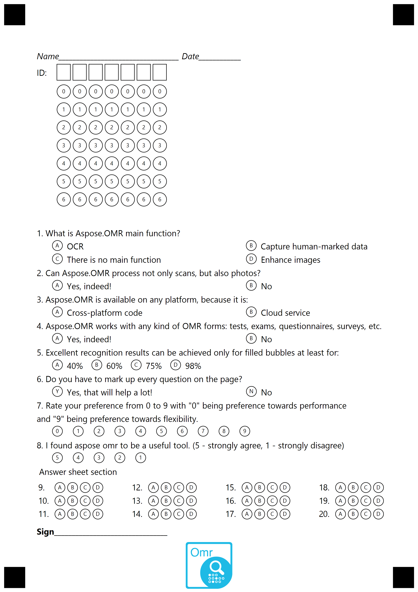






{{< blocks/products/pf/sub-menu logoImageSrc="https://www.aspose.cloud/templates/aspose/App_Themes/V3/images/omr/272x272/aspose_omr-for-net.png" liveDemosLink="https://products.aspose.app/omr/family" PricingLink="https://purchase.aspose.com/pricing/omr/net" buyLink="https://purchase.aspose.com/pricing/omr/net" docsLink="https://docs.aspose.com/omr/net/" installationsDocsLink="" nugetLink="https://www.nuget.org/packages/Aspose.OMR/" nugetPackageName="Aspose.OMR" mavenRepoLink="" directDownloadLink="https://downloads.aspose.com/omr/net" >}}



 
  Aspose.OMR for .NET is a simple and practical OMR software for creating and recognizing answer sheets, tests, MCQ papers, quizzes, feedback forms, surveys, ballots - all types of forms. Our optical mark recognition API is super easy and allows you to design, create and recognize fully customizable forms with various question types, icons, barcodes and other elements.
 

 
  No need for special scanners, papers, or other equipment - Aspose OMR uses advanced image processing algorithms to handle photos and scans with high accuracy. We provide the unique GUI tool to create mark-ups for your existing forms so that they can be recognized with Aspose.OMR software.
 



<!--Diagrams Start-->




 

  

   <header>
    <i class="fa fa-bars">
    </i>
    Features
   </header>
   <ul>
    <li>Create and recognize custom OMR forms</li>
    <li>Process existing forms</li>
    <li>High accuracy rate</li>
    <li>Results in CSV and JSON formats</li>
    <li>GUI for editing complex cases</li>
   </ul>
    <header><i class="fa fa-user-edit">&nbsp;</i>Generation</header>
    <ul>
        <li>Create custom OMR forms using text markup</li>
        <li>Easily generate answer sheet, tests, quizzes, surveys, ballots</li>
        <li>Supports multiple questions, elements, colors, fonts, paper sizes</li>
        <li>Generate ready-to-print OMR forms in PDF or PNG format</li>
    </ul>
  

  <!--/left-->
  

   <header>
    <i class="fa fa-eye">
    </i>
    Recognition
   </header>
   <ul>
    <li>Scanned images</li>
    <li>Photos</li>
    <li>Process rotated images</li>
    <li>Process side viewed images</li>
    <li>Data of various sources</li>
   </ul>
  

  <!--/right-->
 

 <!--/row-->
 

  
  <header>
   Aspose.OMR
  </header>
  <footer>
   <small>
    <em>
     for
    </em>
    .NET
   </small>
  </footer>
 

 <!--/logo-->





 

  

  

  <!--/left-->
  

   <header>
    <i class="fa fa-cubes">
    </i>
    .NET Framework
   </header>
   <ul>
    <li>
     ASP.NET Application
    </li>
    <li>
     Windows Application
    </li>
    <li>
     Web Services
    </li>
   </ul>
  

  <!--/right-->
 

 <!--/row-->
 

  
  <header>
   Aspose.OMR
  </header>
  <footer>
   <small>
    <em>
     for
    </em>
    .NET
   </small>
  </footer>
 

 <!--/logo-->





 

  

   <header>
    <i class="fa fa-arrows-v">
    </i>
    Input Only
   </header>
   <ul>
    <li>
     JPEG, PNG, GIF, TIFF, BMP
    </li>
   </ul>
  

  <!--/left-->
  

   <header>
    <i class="fa fa-long-arrow-down">
    </i>
    Output Only
   </header>
   <ul>
    <li>
     CSV
    </li>
    <li>
     JSON
    </li>
    <li>
     PDF
    </li>
    <li>
     PNG
    </li>
   </ul>
  

  <!--/right-->
 

 <!--/row-->
 

  
  <header>
   Aspose.OMR
  </header>
  <footer>
   <small>
    <em>
     for
    </em>
    .NET
   </small>
  </footer>
 

 <!--/logo-->




<!--Diagrams End-->

<!--Feature-section Start-->

 
 

  

   <h2 class="pr-ft">
    Advanced .NET OMR API Features
   </h2>
   

   

   

    <em class="fa fa-eye ico-blue fa-2x col-lg-2">&nbsp;</em>
    

     Recognize scans and photos
    

   

   

    <em class="fa fa-arrows ico-blue fa-2x col-lg-2">&nbsp;</em>
    

     Process rotated and skewed images
    

   

   

    <em class="fa fa-eye ico-blue fa-2x col-lg-2">&nbsp;</em>
    

     Create and recognize answer sheets, tests, exams, ballots, questionnaires, surveys
    

   

    

    <em class="fa fa-font ico-blue fa-2x col-lg-2">&nbsp;</em>
    

     Supports multiple fonts, colors, OMR elements
    

   

    

        <em class="fa fa-file-pdf ico-blue fa-2x col-lg-2">&nbsp;</em>
        
Generate OMR forms in PDF or PNG

    

   

    <em class="fa fa-check ico-blue fa-2x col-lg-2">&nbsp;</em>
    

     High accuracy rate
    

   

   

    <em class="fa fa-asterisk ico-blue fa-2x col-lg-2">&nbsp;</em>
    

     GUI for correcting complex cases
    

   

   

    <em class="fa fa-file-csv ico-blue fa-2x col-lg-2">&nbsp;</em>
    

     Save results to CSV or JSON format
    

   

   

    <h2 class="h2title">
     How OMR API Works
    </h2>
    

     
      Designed with user needs in mind, Aspose.OMR for .NET is great omr software to solve daily tasks. It takes minimum effort to set up the solution and get the results, regardless of the application field. Highly customizable template generation allows creating custom OMR sheet for any business case.
     
    

    

     <strong>
      Education
     </strong>
    

    

     
      Simple sheets for test, exams or assessments or more complex papers with IDs, text questions and multiple choice questions, Aspose.OMR for .NET can handle it all. It is perfect omr software for teachers since minimum programming skills are required to create and recognize omr forms.
     
    

    

     
      
      
     
    

    

     <strong>
      Surveys
     </strong>
    

    

     
      Conduct surveys of any kind using Aspose.OMR: customer satisfaction surveys, evaluation surveys, public opinions, etc.
     
    

    

     
      
     
    

    

     <strong>
      Create your own template
     </strong>
    

    

     
      Aspose.OMR for .NET API provides methods to generate OMR templates from text description. Using this feature developers can create highly customizable nice looking omr sheets ready for print. API supports several types of elements, including text, choice box (question), answer sheet (several columns of questions), grid (complex values that consist of similar sections). Generated images can be saved as ready-to-print PDF files or PNG images.
     
    

    

     
      No need to start from empty list! Take a look at demonstration markups and generated images for a good understanding of generation capabilities and things you can start on. For more details on features and settings you can check our documentation.
     
    

    <pre><code class="cs">

            // path to the txt markup file
            string markupPath = "Survey01Markup.txt";

            // initialize omr engine
            OmrEngine engine = new OmrEngine();

            // call generation method and get result: image and template (.omr file)
            GenerationResult result = engine.GenerateTemplate(markupPath);

            // path to the folder where the results will be saved
            string outputFolder = "OmrTemplates";

            // the name of the generated template and image
            string templateName = "Survey01";

            // save results
            result.Save(outputFolder, templateName);
</code></pre>
    

     <strong>
      Recognize OMR sheets
     </strong>
    

    

     
      Aspose.OMR for .NET main feature is a recognition. API can recognize photos and scans in multiple image formats, including JPEG, PNG, GIF, TIFF, BMP. In order to recognize images OMR engine requires .omr file, which is a template that describes position and content of the form. Generation provides template with each created form and we offer GUI application for creating template from any user image.
     
    

    

     
      Recognition process is fast and accurate and takes just a couple of seconds per image, depending on the image quality and size. This allows processing large numbers of forms in short amount of time.
     
    

    

     
      The recognition results can be saved as JSON or CSV files.
     
    

    <pre><code class="cs">

            // path to the .omr file
            string templatePath = "MyTest1.omr";

            // initialize engine and get template processor providing path to the .omr file
            OmrEngine engine = new OmrEngine();
            TemplateProcessor templateProcessor = engine.GetTemplateProcessor(templatePath);

            // path to the filled omr form image
            string imagePath = "MyTest1Photo1.jpg";

            // call recognition method and get the result
            RecognitionResult result = templateProcessor.RecognizeImage(imagePath);

            // path to the results file
            string exportPath = "Photo1Results.csv";

            // export results as csv string
            File.WriteAllText(exportPath, result.GetCsv());

</code></pre>
    

     <strong>
      Easy to use
     </strong>
    

    

     
      Aspose.OMR offers an intuitive API with obvious methods signatures. There is no need to spend hours reading the documentation or trying to figure out the code. Simple yet functional, API can be used in different scenarios.
      <a href="https://github.com/aspose-omr/Aspose.OMR-for-.NET">
       Demo materials
      </a>
      that include code samples and demonstration templates can be launched out of the box to showcase software capabilities and workflow.
     
    

   

   <!--

    <h2 class="h2title">Read or Create GIS Data Files</h2>

    
Aspose.GIS for .NET not only supports loading GIS file formats for manipulation & conversion but it also provides the capability to create GIS data files from scratch. .NET developers can use the API to create basic geometries such as Point, MultiPoint, Line, MultiLine, Polygon and so on, which can be further used to generate complex features.

    
-->
   <!--

    <h2 class="h2title">Format-Independent Object Model</h2>

    
Aspose.GIS for .NET lets you manage geometries and feature attributes of supported GIS file formats without worrying about the underlying format implementation. The uniform representation of feature attributes for both ESRI Shapefiles and GeoJSON frees you from writing separate code to manage both formats.

    
-->
   <!--

    <h2 class="h2title">Support for Spatial Reference System</h2>

    
Aspose.GIS for .NET supports Spatial Reference System. .NET GIS API allows you to create spatial reference system from Well-known Text (WKT) as well as provides the ability to export the spatial reference system to WKT. Furthermore, you may also compare spatial reference systems or create one with custom parameters as per application requirements.

    
-->
  

 

<!--Feature-section End-->





























    



