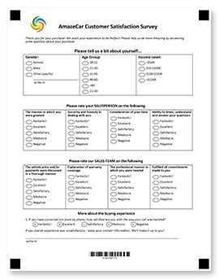










Aspose.OMR voor .NET is een betrouwbare en veelzijdige programmeer-API voor <b>het ontwerpen</b> en <b>automatisch herkennen van</b> met de hand ingevulde antwoordbladen, enquêtes, tests, stembiljetten, SAT-examenformulieren, verzekeringsclaims en soortgelijke documenten waarin respondenten een vraag beantwoorden door een willekeurige teken in een cirkel of vierkant. Het lange en foutgevoelige proces van het handmatig lezen en samenvoegen van resultaten van honderden en duizenden formulieren komt neer op <b>10 regels code</b> in C#, F# of Visual Basic, die zelfs onervaren ontwikkelaars gemakkelijk kunnen begrijpen en ondersteunen.

Onze OMR-bibliotheek biedt een zeer flexibele opmaaktaal waarmee u zonder ontwerptools OMR-klare vormen van elke lay-out en complexiteit kunt maken. U kunt een verscheidenheid aan elementen combineren die het beste passen bij uw doel en doelgroep, en uw OMR-formulieren verder personaliseren en brandmerken door logo&#39;s, streepjescodes, QR-codes of afbeeldingen toe te voegen.



<!--Diagrams Start-->




 

  

   <header>
    <i class="fa fa-bars">
    </i>
    OMR-formulieren maken
   </header>
   <ul>
    <li>Flexibele opmaaktalen</li>
    <li>Programmatisch maken van formulieren</li>
    <li>QR-codes en streepjescodes</li>
    <li>Afbeeldingen en branding toevoegen</li>
    <li>Formulieren met meerdere pagina&#39;s</li>
    <li>Alle populaire papierformaten</li>
    <li>Geen grafische editors nodig</li>
   </ul>
  

  <!--/left-->
  

   <header>
    <i class="fa fa-eye">
    </i>
    OMR-formulieren herkennen
   </header>
   <ul>
    <li>Gescande afbeeldingen en foto&#39;s lezen</li>
    <li>Superieure herkenningsnauwkeurigheid</li>
    <li>Geen apparatuur nodig</li>
    <li>Geroteerde en scheve afbeeldingen aanpassen</li>
    <li>Herken alle soorten tekens</li>
    <li>Nauwkeurigheid in realtime afstemmen</li>
    <li>Decodeer QR-codes en barcodes</li>
    <li>Inschrijfvelden verwerken</li>
   </ul>
  

  <!--/right-->
 

 <!--/row-->
 

  
  <header>
   Aspose.OMR
  </header>
  <footer>
   <small>
    <em>
     for
    </em>
    .NET
   </small>
  </footer>
 

 <!--/logo-->





 

  

   <header>
    <i class="fa fa-cubes">
    </i>
    .NET-implementaties
   </header>
   <ul>
    <li>
     .NET 5.0
    </li>
    <li>
     .NET Core 2.0 of hoger
    </li>
    <li>
     .NET Framework 4.0 of hoger
    </li>
   </ul>
  

  <!--/left-->
  

   <header>
    <i class="fa fa-laptop">
    </i>
    Toepassingen
   </header>
   <ul>
    <li>
     Desktop-applicaties
    </li>
    <li>
     Windows-services
    </li>
    <li>
     ASP.NET MVC
    </li>
    <li>
     ASP.NET Web API
    </li>
    <li>
     Webservices
    </li>
    <li>
     Cloud diensten
    </li>
   </ul>
  

  <!--/right-->
 

 <!--/row-->
 

  
  <header>
   Aspose.OMR
  </header>
  <footer>
   <small>
    <em>
     for
    </em>
    .NET
   </small>
  </footer>
 

 <!--/logo-->





 

  

   <header>
    <i class="fa fa-arrows-v">
    </i>
    Afdrukbare formulieren
   </header>
   <ul>
    <li>
     PDF
    </li>
    <li>
     JPEG
    </li>
    <li>
     PNG
    </li>
    <li>
     TIFF
    </li>
    <li>
     GIF
    </li>
    <li>
     BMP
    </li>
   </ul>
  

  <!--/left-->
  

   <header>
    <i class="fa fa-long-arrow-down">
    </i>
    Erkenningsresultaten
   </header>
   <ul>
    <li>CSV</li>
    <li>JSON</li>
    <li>XML</li>
   </ul>
  

  <!--/right-->
 

 <!--/row-->
 

  
  <header>
   Aspose.OMR
  </header>
  <footer>
   <small>
    <em>
     for
    </em>
    .NET
   </small>
  </footer>
 

 <!--/logo-->




<!--Diagrams End-->

<!--Feature-section Start-->

 
 

  

   <h2 class="pr-ft">
    Functies en mogelijkheden van Aspose.OMR voor .NET
   </h2>
   

   

   

    <em class="fa fa-image ico-blue fa-2x col-lg-2">
    </em>
    

     Ondersteunt alle beeldformaten die u van een scanner of camera kunt krijgen
    

   

   

    <em class="fa fa-mobile ico-blue fa-2x col-lg-2">
    </em>
    

     Gebruik je smartphonecamera in plaats van een scanner
    

   

   

    <em class="fa fa-check ico-blue fa-2x col-lg-2">
    </em>
    

     Leest alle soorten markeringen die zijn getekend met een pen, potlood of stift
    

   

   

    <em class="fa fa-qrcode ico-blue fa-2x col-lg-2">
    </em>
    

     Personaliseer formulieren met barcodes, QR-codes, branding en afbeeldingen
    

   

   

    <em class="fa fa-sliders ico-blue fa-2x col-lg-2">
    </em>
    

     Realtime nauwkeurigheidsafstemming via een visuele UI-bediening
    

   

   

    <em class="fa fa-folder ico-blue fa-2x col-lg-2">
    </em>
    

     Herkent formulieren met meerdere pagina&#39;s en alle afbeeldingen in een map
    

   

   

    <em class="fa fa-file ico-blue fa-2x col-lg-2">
    </em>
    

     Ondersteunt alle populaire papierformaten en niet-standaard papierformaten
    

   

   

    <em class="fa fa-pencil ico-blue fa-2x col-lg-2">
    </em>
    

     Verwerkt inschrijfvelden en aangepaste tekeningen
    

   

   

    <em class="fa fa-eye ico-blue fa-2x col-lg-2">
    </em>
    

     Superieure herkenningsnauwkeurigheid, zelfs in moeilijke omstandigheden
    

   

<h2 class="h2title">Makkelijk te installeren</h2>

Aspose.OMR voor .NET wordt gedistribueerd als een lichtgewicht NuGet-pakket of als een <a href="https://releases.aspose.com/omr/net/">downloadbaar bestand</a> met minimale afhankelijkheden. <a href="https://docs.aspose.com/omr/net/installation/">Installeer</a> het gewoon in uw project en u bent klaar om alle OMR-mogelijkheden te gebruiken en herkenningsresultaten op te slaan in elk van de ondersteunde formaten.

<a href="https://purchase.aspose.com/temporary-license">Vraag een tijdelijke licentie</a> aan om te beginnen met het bouwen van een volledig functionele OMR-applicatie zonder enige beperkingen en beperkingen.

<h2 class="h2title">Makkelijk te gebruiken</h2>

Je hebt maar een paar regels code nodig om een OMR-formulier zoals een klanttevredenheidsonderzoek te maken en het ingevulde formulier te herkennen. Ja, zo simpel is het echt! Neem niet onze woorden, <a href="https://docs.aspose.com/omr/net/hello-world/">probeer het zelf</a> .

<h2 class="h2title">Onbeperkte mogelijkheden</h2>

Optical Mark Recognition (OMR)-technologie heeft veel toepassingen en kan bijna elk deel van uw leven aanzienlijk vereenvoudigen wanneer u handmatig ingevulde gegevens moet verzamelen en analyseren. Het automatiseert het proces volledig, waardoor honderden vellen per minuut kunnen worden herkend met bijna 100% nauwkeurigheid, en slaat de resultaten rechtstreeks op in een database voor verdere aggregatie en analyse. Toepassingen omvatten, maar zijn niet beperkt tot:

<ul>
	<li>Onderwijs: antwoordbladen, tests, quizzen, SAT-formulieren en nog veel meer.</li>
	<li>Vragenlijsten: klanttevredenheidsonderzoeken, feedbackformulieren, bestellingen, maaltijdvoorkeuren.</li>
	<li>Toepassingen: verzekeringsclaims, financiële toepassingen, formulieren voor grensinvoer.</li>
	<li>En nog veel meer.</li>
</ul>

<h2 class="h2title">Formulieren maken zonder ontwerptools</h2>

Onze bibliotheek ondersteunt de volledige OMR-workflow - van het ontwerpen van een formulier tot het herkennen van de ingevulde hardcopy&#39;s. Het biedt zeer flexibele <a href="https://docs.aspose.com/omr/net/design-form/">opmaaktalen</a> met <b>20</b> lay-out- en inhoudselementen die met elkaar kunnen worden gecombineerd om vormen van elke lay-out te produceren.

	
	
	

U kunt de lay-out en inhoud van een OMR-formulier ook direct in de aanvraagcode beschrijven. Deze aanpak werkt het beste wanneer u formulieren moet ontwerpen met gepersonaliseerde velden, zoals de naam van een respondent, een foto of een unieke QR-code.

Herkenningsresultaten worden geretourneerd in de meest populaire gegevensopslagformaten die kunnen worden geïmporteerd in elke populaire database of analysesysteem: JSON, XML of CSV.

<h2 class="h2title">Geen apparatuur nodig</h2>

U heeft geen gespecialiseerde scanners, uniek transoptisch papier, magnetische inkt en andere “hardware”-oplossingen meer nodig. Geavanceerde beeldanalyse en kunstmatige-intelligentietechnieken maakten het mogelijk om een gewone pen en papier, een gewoon kantoorkopieerapparaat of zelfs een smartphonecamera te gebruiken in plaats van speciale apparaten, zonder de nauwkeurigheid van de herkenning en het vertrouwen in het resultaat aan te tasten. Onze bibliotheek maakt het mogelijk om puur softwarematige OMR-oplossingen te bouwen die concurreren met traditionele hardwaregebaseerde systemen tegen veel lagere kosten.

De OMR API corrigeert automatisch geroteerde en scheve afbeeldingen, zodat zelfs foto&#39;s van lage kwaliteit met een hoge mate van vertrouwen worden herkend. In moeilijke gevallen kunt u de verwerking van formulieren verfijnen en resultaten produceren met een nauwkeurigheid van bijna 100%.

<h2 class="h2title">Leer door voorbeeld</h2>

Aspose.OMR voor .NET wordt geleverd met een aantal <a href="https://docs.aspose.com/omr/net/showcases/">voorbeelden</a> waarmee u snel vertrouwd raakt met de functies en mogelijkheden ervan en die u een idee geven van het creëren van oplossingen voor uw zakelijke behoeften.

  

 

<!--Feature-section End-->





























    



