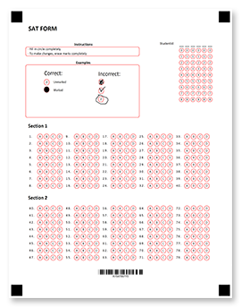










Aspose.OMR för .NET är ett pålitligt och mångsidigt programmerings-API för att <b>designa</b> och <b>automatiskt känna igen</b> handifyllda svarsblad, enkäter, tester, omröstningar, SAT-examensformulär, försäkringsanspråk och liknande dokument där respondenterna svarar på en fråga genom att dra en slumpmässig markera i en cirkel eller kvadrat. Den långa och felbenägna processen att manuellt läsa och sammanställa resultat från hundratals och tusentals formulär kommer ner till <b>10 rader kod</b> i C#, F# eller Visual Basic, som även oerfarna utvecklare lätt kan förstå och stödja.

Vårt OMR-bibliotek erbjuder ett mycket flexibelt märkningsspråk som låter dig skapa OMR-färdiga former av vilken layout och komplexitet som helst utan designverktyg. Du kan kombinera en mängd olika element som bäst passar ditt syfte och målgrupp, och ytterligare personifiera och varumärken dina OMR-formulär genom att lägga till logotyper, streckkoder, QR-koder eller bilder.



<!--Diagrams Start-->




 

  

   <header>
    <i class="fa fa-bars">
    </i>
    Skapa OMR-formulär
   </header>
   <ul>
    <li>Flexibla märkningsspråk</li>
    <li>Programmatiskt skapande av formulär</li>
    <li>QR-koder och streckkoder</li>
    <li>Lägg till bilder och varumärke</li>
    <li>Flersidiga formulär</li>
    <li>Alla populära pappersstorlekar</li>
    <li>Inga grafiska redigerare krävs</li>
   </ul>
  

  <!--/left-->
  

   <header>
    <i class="fa fa-eye">
    </i>
    Känn igen OMR-formulär
   </header>
   <ul>
    <li>Läs skannade bilder och foton</li>
    <li>Överlägsen igenkänningsnoggrannhet</li>
    <li>Ingen utrustning behövs</li>
    <li>Justera roterade och sneda bilder</li>
    <li>Känn igen alla typer av märken</li>
    <li>Noggrannhetsjustering i realtid</li>
    <li>Avkoda QR-koder och streckkoder</li>
    <li>Bearbeta inskrivningsfält</li>
   </ul>
  

  <!--/right-->
 

 <!--/row-->
 

  
  <header>
   Aspose.OMR
  </header>
  <footer>
   <small>
    <em>
     for
    </em>
    .NET
   </small>
  </footer>
 

 <!--/logo-->





 

  

   <header>
    <i class="fa fa-cubes">
    </i>
    .NET-implementationer
   </header>
   <ul>
    <li>
     .NET 5.0
    </li>
    <li>
     .NET Core 2.0 eller senare
    </li>
    <li>
     .NET Framework 4.0 eller senare
    </li>
   </ul>
  

  <!--/left-->
  

   <header>
    <i class="fa fa-laptop">
    </i>
    Ansökningar
   </header>
   <ul>
    <li>
     Desktop-applikationer
    </li>
    <li>
     Windows-tjänster
    </li>
    <li>
     ASP.NET MVC
    </li>
    <li>
     ASP.NET Web API
    </li>
    <li>
     Webbservice
    </li>
    <li>
     Molntjänster
    </li>
   </ul>
  

  <!--/right-->
 

 <!--/row-->
 

  
  <header>
   Aspose.OMR
  </header>
  <footer>
   <small>
    <em>
     for
    </em>
    .NET
   </small>
  </footer>
 

 <!--/logo-->





 

  

   <header>
    <i class="fa fa-arrows-v">
    </i>
    Utskrivbara formulär
   </header>
   <ul>
    <li>
     PDF
    </li>
    <li>
     JPEG
    </li>
    <li>
     PNG
    </li>
    <li>
     TIFF
    </li>
    <li>
     GIF
    </li>
    <li>
     BMP
    </li>
   </ul>
  

  <!--/left-->
  

   <header>
    <i class="fa fa-long-arrow-down">
    </i>
    Erkännande resultat
   </header>
   <ul>
    <li>CSV</li>
    <li>JSON</li>
    <li>XML</li>
   </ul>
  

  <!--/right-->
 

 <!--/row-->
 

  
  <header>
   Aspose.OMR
  </header>
  <footer>
   <small>
    <em>
     for
    </em>
    .NET
   </small>
  </footer>
 

 <!--/logo-->




<!--Diagrams End-->

<!--Feature-section Start-->

 
 

  

   <h2 class="pr-ft">
    Funktioner och funktioner i Aspose.OMR för .NET
   </h2>
   

   

   

    <em class="fa fa-image ico-blue fa-2x col-lg-2">
    </em>
    

     Stöder alla bildformat du kan få från en skanner eller kamera
    

   

   

    <em class="fa fa-mobile ico-blue fa-2x col-lg-2">
    </em>
    

     Använd din smartphones kamera istället för en skanner
    

   

   

    <em class="fa fa-check ico-blue fa-2x col-lg-2">
    </em>
    

     Läser alla typer av märken ritade med penna, penna eller markör
    

   

   

    <em class="fa fa-qrcode ico-blue fa-2x col-lg-2">
    </em>
    

     Anpassa formulär med streckkoder, QR-koder, varumärke och bilder
    

   

   

    <em class="fa fa-sliders ico-blue fa-2x col-lg-2">
    </em>
    

     Inställning av noggrannhet i realtid genom en visuell kontroll av användargränssnittet
    

   

   

    <em class="fa fa-folder ico-blue fa-2x col-lg-2">
    </em>
    

     Känner igen flersidiga formulär och alla bilder i en mapp
    

   

   

    <em class="fa fa-file ico-blue fa-2x col-lg-2">
    </em>
    

     Stöder alla populära pappersstorlekar såväl som icke-standardiserade
    

   

   

    <em class="fa fa-pencil ico-blue fa-2x col-lg-2">
    </em>
    

     Bearbetar inskrivningsfält och anpassade ritningar
    

   

   

    <em class="fa fa-eye ico-blue fa-2x col-lg-2">
    </em>
    

     Överlägsen igenkänningsnoggrannhet även under svåra förhållanden
    

   

<h2 class="h2title">Lätt att installera</h2>

Aspose.OMR för .NET distribueras som ett lätt NuGet-paket eller som en <a href="https://releases.aspose.com/omr/net/">nedladdningsbar fil</a> med minimala beroenden. <a href="https://docs.aspose.com/omr/net/installation/">Installera</a> det helt enkelt i ditt projekt och du är redo att använda alla OMR-funktioner och spara igenkänningsresultat i något av de format som stöds.

<a href="https://purchase.aspose.com/temporary-license">Begär en tillfällig licens</a> för att börja bygga en fullt fungerande OMR-applikation utan några begränsningar och restriktioner.

<h2 class="h2title">Lätt att använda</h2>

Du behöver bara några rader kod för att skapa ett OMR-formulär som en kundnöjdhetsundersökning och känna igen det ifyllda formuläret. Ja, det är verkligen så enkelt! Ta inte våra ord, <a href="https://docs.aspose.com/omr/net/hello-world/">prova själv</a> .

<h2 class="h2title">Obegränsade möjligheter</h2>

Optical Mark Recognition (OMR)-teknik har många applikationer och kan avsevärt förenkla nästan vilken del av ditt liv som helst när du behöver samla in och analysera manuellt ifylld data. Den automatiserar processen helt, vilket gör att hundratals ark per minut kan identifieras med nästan 100 % noggrannhet, och sparar resultaten direkt i en databas för ytterligare aggregering och analys. Ansökningar inkluderar men är inte begränsade till:

<ul>
	<li>Utbildning: svarsblad, tester, frågesporter, SAT-formulär och många fler.</li>
	<li>Frågeformulär: kundnöjdhetsundersökningar, feedbackformulär, beställningar, måltidspreferenser.</li>
	<li>Ansökningar: försäkringskrav, finansiella ansökningar, formulär för gränsinträde.</li>
	<li>Och många fler.</li>
</ul>

<h2 class="h2title">Skapa formulär utan designverktyg</h2>

Vårt bibliotek stöder hela OMR-arbetsflödet - från att designa ett formulär till att känna igen dess ifyllda papperskopior. Den erbjuder mycket flexibla <a href="https://docs.aspose.com/omr/net/design-form/">märkningsspråk</a> med <b>20</b> layout- och innehållselement som kan kombineras med varandra för att skapa former av vilken layout som helst.

	
	
	

Du kan också beskriva layout och innehåll i ett OMR-formulär direkt i ansökningskoden. Detta tillvägagångssätt fungerar bäst när du behöver designa formulär med personliga fält som en respondents namn, foto eller en unik QR-kod.

Igenkänningsresultat returneras i de mest populära datalagringsformaten som kan importeras till alla populära databas- eller analyssystem: JSON, XML eller CSV.

<h2 class="h2title">Ingen utrustning behövs</h2>

Du behöver inte längre specialiserade skannrar, unikt transoptiskt papper, magnetiskt bläck och andra &quot;hårdvarulösningar&quot;. Avancerad bildanalys och tekniker för artificiell intelligens gjorde det möjligt att använda en vanlig penna och papper, vanlig kontorskopiator eller till och med en smartphonekamera istället för dedikerade enheter, utan att det påverkade igenkänningsnoggrannheten och förtroendet för resultatet. Vårt bibliotek gör det möjligt att bygga rent mjukvaru-OMR-lösningar som konkurrerar i paritet med traditionella hårdvarubaserade system till en mycket lägre kostnad.

OMR API korrigerar automatiskt roterade och sneda bilder så att även foton av låg kvalitet känns igen med en hög grad av tillförsikt. I svåra fall kan du finjustera formbearbetningen och producera resultat med nästan 100 % noggrannhet.

<h2 class="h2title">Lär dig genom exempel</h2>

Aspose.OMR för .NET kommer med ett antal <a href="https://docs.aspose.com/omr/net/showcases/">exempel</a> som gör att du snabbt kan bekanta dig med dess funktioner och möjligheter och ger dig en uppfattning om hur du skapar lösningar för dina affärsbehov.

  

 

<!--Feature-section End-->





























    



